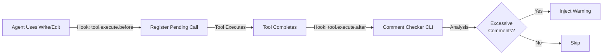

## Overview

The Comment Checker hook **detects and warns about excessive AI-generated comments** in code. It analyzes Write and Edit tool outputs for comment patterns commonly produced by LLMs and reminds agents to reduce verbosity.

<Info>
  AI agents tend to over-comment code with phrases like "Helper function to...", "TODO: Implement...", or redundant docstrings. Comment Checker catches these patterns and encourages cleaner code.
</Info>

## How It Works



**Lifecycle:**

1. **Before tool execution**: Hook registers the file path and content
2. **After tool execution**: Hook analyzes content via external CLI
3. **Detection**: CLI scans for AI comment patterns
4. **Warning**: If excessive comments detected, warning injected into session

## What Gets Detected

The checker identifies common AI comment patterns:

<AccordionGroup>
  <Accordion title="Redundant explanations">
    Comments that restate obvious code:
    
    ```typescript
    // Get user by ID
    function getUserById(id: string) { ... }
    
    // Return the result
    return result
    ```
  </Accordion>
  
  <Accordion title="Filler phrases">
    AI-generated filler:
    
    - "Helper function to..."
    - "Utility method for..."
    - "This function handles..."
    - "Main entry point for..."
  </Accordion>
  
  <Accordion title="Excessive TODOs">
    Over-use of TODO comments:
    
    ```typescript
    // TODO: Add error handling
    // TODO: Validate input
    // TODO: Add logging
    // TODO: Optimize performance
    ```
  </Accordion>
  
  <Accordion title="Redundant docstrings">
    Docstrings that don't add information beyond the function signature:
    
    ```typescript
    /**
     * Calculate total
     * @param items - The items
     * @returns The total
     */
    function calculateTotal(items: Item[]): number { ... }
    ```
  </Accordion>
</AccordionGroup>

## What Gets Ignored

The checker **smartly ignores** legitimate comments:

<CardGroup cols={3}>
  <Card title="BDD/Test Comments" icon="flask">
    ```typescript
    // given - user is authenticated
    // when - user logs out
    // then - session cleared
    ```
  </Card>
  
  <Card title="Directive Comments" icon="code">
    ```typescript
    // @ts-expect-error - legacy API
    // eslint-disable-next-line
    // prettier-ignore
    ```
  </Card>
  
  <Card title="Meaningful Docstrings" icon="book">
    ```typescript
    /**
     * Implements exponential backoff
     * with jitter for retry logic.
     * 
     * Uses base delay * 2^attempt + random(0, 1000)
     */
    function retry() { ... }
    ```
  </Card>
</CardGroup>

## Warning Message

When excessive comments are detected, the agent receives:

```
━━━━━━━━━━━━━━━━━━━━━━━━━━━━━━━━━━━━━━━━━━━━━━━━━━
CODE QUALITY REMINDER
━━━━━━━━━━━━━━━━━━━━━━━━━━━━━━━━━━━━━━━━━━━━━━━━━━

Excessive comments detected in: src/api/users.ts

Detected patterns:
- Redundant explanations (5 instances)
- Filler phrases (3 instances)

Reminder: Code should be self-explanatory. Remove comments that:
- Restate obvious logic
- Use filler phrases ("Helper function to...")
- Add no information beyond the code itself

Keep:
- BDD test comments (given/when/then)
- Directive comments (@ts-expect-error, eslint-disable)
- Non-obvious algorithm explanations
- "Why" over "what"

If you just wrote this file, consider revising to reduce verbosity.
```

<Note>
  The warning is **informational only**. It doesn't block the tool execution or modify code. The agent can choose to revise or proceed.
</Note>

## Supported Tools

Comment Checker analyzes:

- **Write**: New file creation
- **Edit**: File modifications
- **MultiEdit**: Multiple file edits
- **apply_patch**: Patch-based edits (multi-file)

<Info>
  For `apply_patch`, the checker analyzes all modified files (excluding deletions) and provides a summary of issues across all files.
</Info>

## Configuration

### Custom Prompt

Override the default warning message:

```json
{
  "comment_checker": {
    "custom_prompt": "Avoid over-commenting. Focus on 'why', not 'what'."
  }
}
```

<ParamField path="custom_prompt" type="string">
  Custom message to show when excessive comments detected. Replaces the default verbose warning.
</ParamField>

### Disable Comment Checker

Turn it off entirely:

```json
{
  "disabled_hooks": ["comment-checker"]
}
```

<Warning>
  Disabling comment checker means agents won't receive reminders about code quality. Only disable if you prefer verbose comments or handle this manually.
</Warning>

## Technical Details

### External CLI

Comment Checker uses a bundled Rust CLI binary for fast pattern detection:

- **Location**: Downloaded to `~/.cache/oh-my-opencode/comment-checker-cli`
- **Detection**: Pattern matching + heuristics (not LLM-based)
- **Performance**: Sub-100ms analysis for most files

<Tip>
  The CLI is downloaded automatically on first use. If you encounter issues, check `~/.cache/oh-my-opencode/` for the binary.
</Tip>

### Hook Events

**tool.execute.before:**
- Registers pending calls for Write/Edit/MultiEdit/apply_patch
- Stores file path, content, old/new strings

**tool.execute.after:**
- Retrieves pending call
- Invokes CLI for analysis
- Injects warning if patterns detected

### Pending Call Cleanup

Pending calls are automatically cleaned up:

- **On completion**: Removed after tool.execute.after processes them
- **On timeout**: 5-minute expiry for stale calls
- **On session end**: All pending calls cleared

## Best Practices

<AccordionGroup>
  <Accordion title="Self-explanatory code over comments">
    Prefer clear naming:
    
    ❌
    ```typescript
    // Get user
    function get(id: string) { ... }
    ```
    
    ✅
    ```typescript
    function getUserById(id: string) { ... }
    ```
  </Accordion>

  <Accordion title="'Why' not 'what'">
    Comments should explain motivation, not mechanics:
    
    ❌
    ```typescript
    // Loop through items
    for (const item of items) { ... }
    ```
    
    ✅
    ```typescript
    // Process items in insertion order to preserve dependencies
    for (const item of items) { ... }
    ```
  </Accordion>

  <Accordion title="Docstrings for public APIs">
    Keep docstrings for:
    - Public functions/classes
    - Complex algorithms
    - Non-obvious behavior
    
    Skip for:
    - Trivial getters/setters
    - Self-explanatory utility functions
  </Accordion>

  <Accordion title="Remove TODOs after implementation">
    TODOs are temporary notes. Once implemented, delete them:
    
    ❌
    ```typescript
    // TODO: Add validation (done)
    if (!isValid(input)) { ... }
    ```
    
    ✅
    ```typescript
    if (!isValid(input)) { ... }
    ```
  </Accordion>
</AccordionGroup>

## Example: Before/After

### Before (AI-Generated)

```typescript
// Helper function to calculate total price
function calculateTotal(items: Item[]): number {
  // Initialize result variable
  let total = 0
  
  // Loop through all items
  for (const item of items) {
    // Add item price to total
    total += item.price
  }
  
  // Return the result
  return total
}

// TODO: Add error handling
// TODO: Validate items array
// TODO: Add logging
```

**Comment Checker Warning:**
```
Excessive comments detected: src/utils.ts
- Redundant explanations (6 instances)
- Filler phrases (1 instance)
- Excessive TODOs (3 instances)
```

### After (Revised)

```typescript
function calculateTotal(items: Item[]): number {
  return items.reduce((sum, item) => sum + item.price, 0)
}
```

<Check>
  **Result:** Clean, self-explanatory code with zero comments. The function name and implementation are clear enough.
</Check>

## Troubleshooting

<AccordionGroup>
  <Accordion title="CLI not found or download fails">
    **Symptoms:** Hook logs "CLI not available, skipping comment check"
    
    **Solutions:**
    - Check internet connection (CLI downloads on first use)
    - Verify `~/.cache/oh-my-opencode/` directory exists and is writable
    - Manually download from releases (fallback)
  </Accordion>

  <Accordion title="False positives on legitimate comments">
    **Symptoms:** Warning triggered for BDD/directive comments
    
    **Cause:** CLI pattern matching edge case
    
    **Solutions:**
    - Report issue with example (helps improve detection)
    - Use custom prompt to reduce noise:
      
      ```json
      { "comment_checker": { "custom_prompt": "Keep comments minimal." } }
      ```
  </Accordion>

  <Accordion title="Warning appears but no comments in output">
    **Symptoms:** Warning shows, but agent's output has no comments
    
    **Cause:** Detection runs on tool input (before execution), not output
    
    **Explanation:** Hook analyzes the content the agent **intended** to write. If the agent revises after the warning, the final output may differ.
  </Accordion>

  <Accordion title="Disable for specific files or patterns">
    **Current limitation:** No per-file configuration
    
    **Workaround:** Disable globally for projects where verbose comments are preferred:
    
    ```json
    { "disabled_hooks": ["comment-checker"] }
    ```
  </Accordion>
</AccordionGroup>

## Debug Mode

Enable detailed logging:

```bash
export COMMENT_CHECKER_DEBUG=1
```

Logs written to: `/tmp/comment-checker-debug.log`

Includes:
- Hook invocation details
- CLI execution output
- Pattern detection results
- Warning injection status

## Related Features

- [Deep Initialization](/advanced/deep-initialization) - Generate AGENTS.md with clean, telegraphic style
- [Ralph Loop](/advanced/ralph-loop) - Self-referential loops that produce quality code
- [Prometheus Planner](/advanced/prometheus-planner) - Planning that emphasizes clean implementation