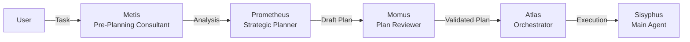

## Overview

Prometheus is a specialized planning agent that **interviews you before execution**. Instead of diving into code immediately, it asks clarifying questions, identifies ambiguities, and builds a detailed plan.

<Info>
  Prometheus is named after the Greek Titan who planned ahead and brought foresight to humanity. He questions, analyzes, and ensures you know exactly what you're building before a single line is touched.
</Info>

## Key Features

- **Interview mode**: Iterative questioning to identify scope and ambiguities
- **Strategic planning**: Detailed work plans before code execution
- **Pre-planning analysis**: Hidden intentions and AI failure point detection via Metis
- **Plan validation**: Momus reviews plans for clarity and completeness
- **Markdown-only output**: Enforced read-only mode for planning phase

## Architecture

Prometheus works with two consultant agents:



### Agent Roles

<CardGroup cols={3}>
  <Card title="Metis" icon="magnifying-glass">
    **Pre-Planning Consultant**
    
    Identifies hidden intentions, ambiguities, and AI failure points before planning begins.
  </Card>
  
  <Card title="Prometheus" icon="clipboard-list">
    **Strategic Planner**
    
    Creates detailed work plans through iterative questioning. Interview mode: questions first, code later.
  </Card>
  
  <Card title="Momus" icon="clipboard-check">
    **Plan Reviewer**
    
    Validates plans against clarity, verifiability, and completeness standards.
  </Card>
</CardGroup>

## Usage

### Via /start-work Command

The most common way to invoke Prometheus:

```
/start-work "Build a REST API with JWT authentication"
```

**Workflow:**

1. Prometheus interviews you about requirements
2. Creates a detailed plan
3. Plan is validated by Momus
4. Atlas orchestrator executes the plan with Sisyphus

<Steps>
  <Step title="Prometheus interviews">
    Asks clarifying questions about:
    - Tech stack preferences
    - Database choices
    - Authentication flow details
    - Error handling requirements
    - Testing expectations
  </Step>
  
  <Step title="Plan creation">
    Generates structured plan with:
    - Clear objectives
    - Step-by-step tasks
    - Dependencies
    - Verification criteria
  </Step>
  
  <Step title="Plan validation">
    Momus reviews for:
    - Clarity of each step
    - Verifiability of outcomes
    - Completeness of coverage
  </Step>
  
  <Step title="Execution">
    Atlas breaks down the plan into todos and coordinates Sisyphus to execute.
  </Step>
</Steps>

### Direct Invocation

You can also call Prometheus directly:

```
Ask @prometheus to create a plan for migrating from Express to Fastify
```

## Model Configuration

**Default Model:** `claude-opus-4-6`  
**Fallback Chain:** `gpt-5.4` → `gemini-3.1-pro`

### Override Models

Customize in `oh-my-opencode.json`:

```json
{
  "agents": {
    "prometheus": {
      "model": "openai/gpt-5.4",
      "variant": "xhigh",
      "temperature": 0.3
    }
  }
}
```

<Tip>
  Prometheus benefits from extended thinking models. Consider using `claude-opus-4-6` with thinking enabled or `gpt-5.4` on xhigh variant.
</Tip>

## Example Session

### User Prompt

```
/start-work "Implement real-time notifications"
```

### Prometheus Interview

<Accordion title="Prometheus Questions">
**Prometheus:** I need to understand the scope better. Can you clarify:

1. What triggers these notifications? (User actions, system events, external webhooks?)
2. What's the notification delivery method? (WebSocket, SSE, polling, push notifications?)
3. Who receives notifications? (Logged-in users only, offline users, specific roles?)
4. What's the persistence requirement? (In-memory, database, message queue?)
5. What scale are we targeting? (Concurrent users: 10? 100? 10,000?)
</Accordion>

### User Answers

<Accordion title="User Responses">
1. User actions (likes, comments, mentions)
2. WebSocket for online users, store for offline retrieval
3. Logged-in users, with role-based filtering
4. Database persistence (PostgreSQL)
5. ~500 concurrent users
</Accordion>

### Generated Plan

<Accordion title="Prometheus Plan">
```markdown
# Real-Time Notifications Implementation Plan

## Objectives
- Deliver instant notifications via WebSocket
- Store notifications for offline users
- Support role-based filtering
- Handle ~500 concurrent users

## Tasks

### 1. Database Schema
- Create `notifications` table (id, user_id, type, content, read_at, created_at)
- Add indexes on user_id, read_at for fast queries
- Migration script

**Verify:** Schema exists, indexes created

### 2. WebSocket Server
- Set up Socket.IO server
- Implement authentication middleware (JWT)
- Connection management (track online users)
- Room-based broadcasting (per-user rooms)

**Verify:** WebSocket connects, authenticates, joins user room

### 3. Notification Service
- Event emitter for notification triggers
- Dual path: WebSocket (online) + DB (offline)
- Role check before delivery

**Verify:** Notification sent to online user, stored for offline

### 4. Client Integration
- WebSocket client setup
- Auto-reconnect logic
- Notification UI component
- Unread badge counter

**Verify:** Client receives, displays, marks read

### 5. Testing
- Unit: notification service
- Integration: WebSocket delivery
- Load: 500 concurrent connections

**Verify:** All tests pass, load test stable

## Dependencies
- Task 2 depends on Task 1 (schema needed for storage)
- Task 3 depends on Task 2 (WebSocket server must exist)
- Task 4 depends on Task 3 (service must be ready)
```
</Accordion>

### Momus Review

<Accordion title="Momus Validation">
**Momus Review:**

✅ **Clarity:** Each task has clear objectives  
✅ **Verifiability:** Every task has "Verify" criteria  
✅ **Completeness:** Covers DB, server, client, testing  
⚠️ **Recommendation:** Add error handling section (WebSocket disconnects, DB failures)

**Plan Status:** APPROVED with minor enhancement
</Accordion>

## Interview Mode Behavior

Prometheus follows a specific interview pattern:

1. **Initial Analysis**: Reviews the task and identifies unknowns
2. **Question Formation**: Groups related questions (tech, scale, UX)
3. **Iterative Refinement**: Asks follow-ups based on your answers
4. **Scope Lock**: Confirms final understanding before planning
5. **Plan Generation**: Creates detailed plan only after full clarity

<Note>
  Prometheus won't start coding during the planning phase. The `prometheus-md-only` hook enforces markdown-only output.
</Note>

## Tool Restrictions

During planning, Prometheus:

- ✅ **Can:** Read files, search codebase, analyze patterns
- ❌ **Cannot:** Write code, edit files, delegate tasks
- 📝 **Output:** Markdown plans only

This ensures planning stays pure — no premature implementation.

## Best Practices

<AccordionGroup>
  <Accordion title="Provide context upfront">
    The more context you give initially, the fewer questions Prometheus needs to ask:
    
    ❌ "Add search"
    
    ✅ "Add full-text search to blog posts using PostgreSQL's tsvector, with filters for date and category"
  </Accordion>

  <Accordion title="Answer questions thoroughly">
    Vague answers lead to vague plans:
    
    ❌ "Whatever works"
    
    ✅ "Use Redis for session caching (we already have it), PostgreSQL for permanent storage"
  </Accordion>

  <Accordion title="Review the plan before execution">
    Always read the generated plan. If something looks off, ask Prometheus to revise:
    
    "This plan looks good, but can you add a section on database migration strategy?"
  </Accordion>

  <Accordion title="Use for complex tasks">
    Prometheus shines on hairy problems:
    
    - Architecture decisions
    - Multi-step refactoring
    - System integrations
    - Migration planning
    
    For simple tasks ("fix typo in README"), skip planning and use Sisyphus directly.
  </Accordion>
</AccordionGroup>

## Configuration Options

```json
{
  "agents": {
    "prometheus": {
      "model": "anthropic/claude-opus-4-6",
      "variant": "max",
      "temperature": 0.3,
      "thinking": {
        "type": "enabled",
        "budgetTokens": 32000
      },
      "maxTokens": 8000
    },
    "metis": {
      "model": "anthropic/claude-opus-4-6"
    },
    "momus": {
      "model": "openai/gpt-5.4"
    }
  }
}
```

<ParamField path="model" type="string" default="claude-opus-4-6">
  Model ID for Prometheus. Supports extended thinking models.
</ParamField>

<ParamField path="variant" type="string">
  Model variant (e.g., `max`, `xhigh`). Higher variants better for complex planning.
</ParamField>

<ParamField path="temperature" type="number" default="0.7">
  Creativity level. Lower (0.3) for deterministic plans, higher (0.8) for creative solutions.
</ParamField>

<ParamField path="thinking" type="object">
  Extended thinking configuration for deeper analysis.
</ParamField>

## Workflow Integration

### With Ralph Loop

Combine planning with self-referential execution:

```
/start-work "Implement caching layer"
# Prometheus creates plan
# Atlas breaks it into todos
/ralph-loop "Execute the plan Prometheus created"
```

### With Categories

Delegate execution to specialized categories:

```markdown
# After Prometheus creates plan

## Database Schema Task
task(category="unspecified-low", load_skills=[], prompt="Execute Task 1: Database Schema from the plan")

## WebSocket Server Task  
task(category="deep", load_skills=[], prompt="Execute Task 2: WebSocket Server from the plan")
```

## Troubleshooting

<AccordionGroup>
  <Accordion title="Prometheus asks too many questions">
    Provide more upfront context. Include:
    - Tech stack
    - Scale requirements
    - Existing patterns in your codebase
    - Constraints (time, compatibility)
  </Accordion>

  <Accordion title="Plan is too vague">
    Ask Prometheus to refine:
    
    "Can you break down Task 3 into smaller subtasks with verification criteria?"
  </Accordion>

  <Accordion title="Prometheus starts coding">
    The `prometheus-md-only` hook should prevent this. If it happens, check:
    - Is the hook disabled in config?
    - Are you using a custom agent override?
  </Accordion>
</AccordionGroup>

## Related Features

- [Deep Initialization](/advanced/deep-initialization) - Auto-generate project context for better planning
- [Ralph Loop](/advanced/ralph-loop) - Execute plans with self-referential loops
- [Todo Enforcer](/advanced/todo-enforcer) - Ensure plan tasks complete