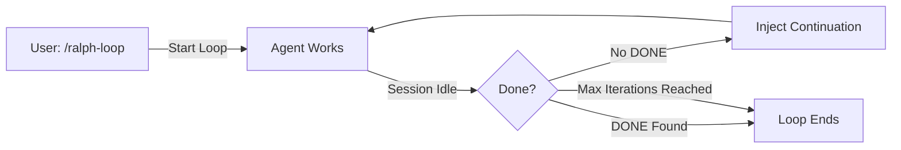

## Overview

Ralph Loop is a **self-referential development loop** that forces agents to continue working until they explicitly declare completion. Instead of stopping halfway, the loop auto-continues until the agent outputs `<promise>DONE</promise>`.

<Info>
  Named after Anthropic's Ralph Wiggum plugin, this mechanism ensures tasks reach 100% completion. The agent doesn't stop until it's truly done — no half-finished work.
</Info>

## How It Works



**Lifecycle:**

1. User runs `/ralph-loop "task description"`
2. Agent starts working
3. When agent goes idle, system scans output for `<promise>DONE</promise>`
4. If not found: inject continuation prompt → agent continues
5. If found: loop ends
6. Safety: max iterations (default 100)

## Basic Usage

```
/ralph-loop "Build a REST API with authentication"
```

The agent will:
- Work on the task continuously
- Self-evaluate progress
- Continue until fully complete
- Output `<promise>DONE</promise>` when finished

<CodeGroup>
```bash Simple task
/ralph-loop "Refactor the payment module to use async/await"
```

```bash Complex task
/ralph-loop "Migrate from Express to Fastify, including all middleware and tests"
```

```bash Custom iterations
/ralph-loop "Build admin dashboard" --max-iterations=50
```
</CodeGroup>

## Commands

### /ralph-loop

Starts a standard ralph loop.

**Syntax:**
```
/ralph-loop "<task>" [--max-iterations=N] [--completion-promise=TEXT]
```

**Options:**
- `--max-iterations`: Maximum loop iterations (default: 100)
- `--completion-promise`: Custom completion signal (default: "DONE")

**Examples:**
```
/ralph-loop "Add user authentication"
/ralph-loop "Refactor database layer" --max-iterations=50
/ralph-loop "Fix all TypeScript errors" --completion-promise="ALL_FIXED"
```

### /ulw-loop

Ultrawork loop — same as ralph-loop but with **maximum intensity**.

**Differences from /ralph-loop:**
- Activates ultrawork mode (parallel agents, background tasks, aggressive exploration)
- No iteration limit (runs until verified completion)
- Requires Oracle verification after `<promise>DONE</promise>`

**Syntax:**
```
/ulw-loop "<task>" [--completion-promise=TEXT]
```

**Examples:**
```
/ulw-loop "Implement real-time notifications end-to-end"
/ulw-loop "Build complete CI/CD pipeline with testing"
```

<Warning>
  `/ulw-loop` is more aggressive than `/ralph-loop`. Use it for complex, multi-part tasks where you want every available agent working in parallel.
</Warning>

### /cancel-ralph

Stops the active ralph loop.

```
/cancel-ralph
```

**What it does:**
- Stops the loop from continuing
- Clears the loop state file (`.sisyphus/ralph-loop.local.md`)
- Allows the session to end normally

<Tip>
  Use `/cancel-ralph` if the agent is stuck or if you want to change direction mid-loop.
</Tip>

## Configuration

Customize ralph loop behavior in `oh-my-opencode.json`:

```json
{
  "ralph_loop": {
    "enabled": true,
    "default_max_iterations": 100
  }
}
```

<ParamField path="enabled" type="boolean" default={true}>
  Enable or disable ralph loop functionality.
</ParamField>

<ParamField path="default_max_iterations" type="number" default={100}>
  Default maximum iterations before forced stop.
</ParamField>

## How Agents Signal Completion

The agent outputs a completion promise tag when done:

```xml
<promise>DONE</promise>
```

**Example agent response:**

```
I've completed all the tasks:

✅ Implemented JWT authentication
✅ Added refresh token logic
✅ Created login/logout endpoints
✅ Added middleware for protected routes
✅ Wrote unit tests (100% coverage)
✅ Updated documentation

All tests pass. The authentication system is fully functional.

<promise>DONE</promise>
```

### Custom Completion Promises

You can customize the completion signal:

```
/ralph-loop "Fix all linter warnings" --completion-promise="LINT_CLEAN"
```

Agent must output `<promise>LINT_CLEAN</promise>` to end the loop.

## State Persistence

Ralph loop state is stored in `.sisyphus/ralph-loop.local.md` (gitignored):

```markdown
---
sessionID: "sess_abc123"
prompt: "Build a REST API with authentication"
iteration: 15
maxIterations: 100
completionPromise: "DONE"
ultrawork: false
---

Loop active. Agent working on iteration 15/100.
```

This allows the loop to survive session restarts (if you close and reopen OpenCode).

## Exit Conditions

The loop ends when:

1. **Completion detected**: Agent outputs `<promise>DONE</promise>`
2. **Max iterations reached**: Default 100 (configurable)
3. **Manual cancel**: User runs `/cancel-ralph`

<Note>
  For `/ulw-loop`, there's an additional step: Oracle verification after completion before the loop truly ends.
</Note>

## Workflow Examples

### Simple Refactoring

```
/ralph-loop "Refactor the user service to use dependency injection"
```

**What happens:**
1. Agent analyzes user service
2. Creates abstraction interfaces
3. Refactors to use DI
4. Updates tests
5. Verifies all tests pass
6. Outputs `<promise>DONE</promise>`

### Complex Feature Implementation

```
/ulw-loop "Implement search functionality with filters, pagination, and autocomplete"
```

**What happens:**
1. Agent spawns parallel subagents:
   - Backend: Search API with filters
   - Frontend: Search UI with autocomplete
   - Database: Indexes for performance
2. Main agent coordinates
3. Integration testing
4. Agent outputs `<promise>DONE</promise>`
5. Oracle verifies completeness
6. Loop ends

## Best Practices

<AccordionGroup>
  <Accordion title="Be specific with tasks">
    Clear tasks get better results:
    
    ❌ "Fix bugs"
    
    ✅ "Fix all TypeScript type errors in src/api/ directory"
  </Accordion>

  <Accordion title="Set reasonable max iterations">
    Estimate task complexity:
    
    - Simple task (refactor 1 file): 20 iterations
    - Medium task (add feature): 50 iterations
    - Complex task (migration): 100+ iterations
  </Accordion>

  <Accordion title="Use /ulw-loop for multi-part tasks">
    `/ulw-loop` is better for:
    - Features spanning frontend + backend
    - Database migrations with testing
    - Multi-file refactoring with verification
    
    Use `/ralph-loop` for:
    - Single-file changes
    - Focused refactoring
    - Bug fixes
  </Accordion>

  <Accordion title="Monitor progress">
    Check session todos to see what the agent is working on:
    
    ```
    What todos remain?
    ```
    
    The agent will list incomplete tasks, giving you visibility into progress.
  </Accordion>
</AccordionGroup>

## Troubleshooting

<AccordionGroup>
  <Accordion title="Loop never completes">
    **Symptoms:** Agent keeps working past expected completion
    
    **Causes:**
    - Task too vague ("make it better")
    - No clear success criteria
    - Agent stuck in analysis loop
    
    **Solutions:**
    - Run `/cancel-ralph` and restart with clearer task
    - Add specific completion criteria:
      
      "Refactor payment module AND ensure all tests pass AND coverage >80%"
  </Accordion>

  <Accordion title="Agent stops before done">
    **Symptoms:** Agent outputs `<promise>DONE</promise>` prematurely
    
    **Cause:** Agent misunderstood task scope
    
    **Solution:** Be more explicit:
    
    ❌ "Add authentication"
    
    ✅ "Add JWT authentication with login, logout, token refresh, protected routes, and tests"
  </Accordion>

  <Accordion title="Max iterations reached">
    **Symptoms:** Loop stops at iteration limit without completion
    
    **Cause:** Task is larger than expected
    
    **Solutions:**
    - Break into smaller tasks
    - Increase max iterations: `--max-iterations=200`
    - Use `/ulw-loop` for unlimited iterations
  </Accordion>

  <Accordion title="Loop state persists after cancel">
    **Symptoms:** `/cancel-ralph` doesn't stop the loop
    
    **Solution:** Manually delete state file:
    
    ```bash
    rm .sisyphus/ralph-loop.local.md
    ```
  </Accordion>
</AccordionGroup>

## Advanced: Loop Continuation Prompts

When the agent goes idle without completion, the system injects:

```
You are in a ralph loop. Your task:

"{original task description}"

Current iteration: 15/100

You have not output the completion promise yet. This means the task is not done.

Continue working toward completion. When fully complete, output:
<promise>DONE</promise>
```

This keeps the agent focused on the original goal.

## Comparison: /ralph-loop vs /ulw-loop

| Feature | /ralph-loop | /ulw-loop |
|---------|-------------|------------|
| **Max iterations** | 100 (configurable) | Unlimited |
| **Intensity** | Standard | Ultrawork mode |
| **Parallel agents** | Optional | Aggressive |
| **Background tasks** | Optional | Automatic |
| **Verification** | Self-declared | Oracle-verified |
| **Use case** | Focused tasks | Complex, multi-part tasks |

## Related Features

- [Todo Enforcer](/advanced/todo-enforcer) - Keeps agents working on incomplete todos
- [Prometheus Planner](/advanced/prometheus-planner) - Plan before executing with ralph loop
- [Deep Initialization](/advanced/deep-initialization) - Context for better loop execution