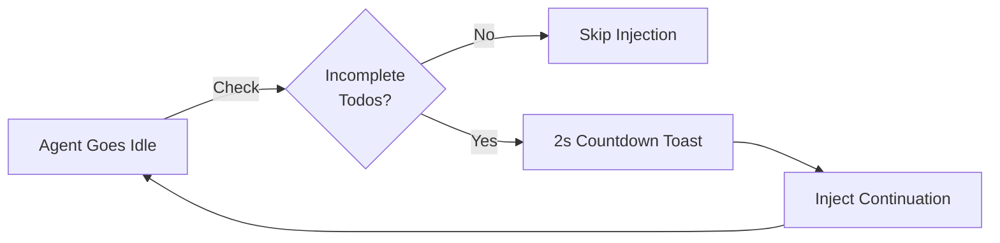

## Overview

The Todo Enforcer (also known as "the boulder") is a **continuation mechanism** that prevents agents from going idle when incomplete todos remain. When the agent stops working, the enforcer automatically injects a continuation prompt to yank it back to work.

<Info>
  Named after Sisyphus eternally rolling a boulder uphill, this mechanism ensures your agent keeps pushing until tasks reach completion — no premature stopping.
</Info>

## How It Works



**Workflow:**

1. Agent finishes current work and goes idle
2. System checks for incomplete todos
3. If todos remain: 2-second countdown toast appears
4. Continuation prompt injected: "TODO CONTINUATION - complete remaining tasks"
5. Agent resumes work

<Warning>
  The enforcer only activates for **main sessions** (Sisyphus, Hephaestus). It skips planning agents (Prometheus) and utility agents (compaction).
</Warning>

## Activation Conditions

The enforcer injects continuation when **all** conditions are met:

<Steps>
  <Step title="Session is eligible">
    - Not a planning agent (Prometheus, Metis, Momus)
    - Not a compaction agent
    - Not in recovery mode
  </Step>
  
  <Step title="Todos are incomplete">
    - At least one todo with status `pending` or `in_progress`
    - Blocked/deleted todos don't count
  </Step>
  
  <Step title="No recent abort">
    - No abort signal in last 3 seconds
    - Abort cleared by user activity or tool execution
  </Step>
  
  <Step title="No active work">
    - No background tasks running for this session
    - Agent truly idle (not executing tools)
  </Step>
  
  <Step title="Cooldown passed">
    - 30 seconds since last injection
    - Exponential backoff on repeated failures
  </Step>
  
  <Step title="Failure limit not reached">
    - Fewer than 5 consecutive injection failures
    - Failures reset after 5 minutes or successful injection
  </Step>
</Steps>

## Continuation Prompt

When injected, the system sends:

```
━━━━━━━━━━━━━━━━━━━━━━━━━━━━━━━━━━━━━━━━━━━━━━━━━━
TODO CONTINUATION
━━━━━━━━━━━━━━━━━━━━━━━━━━━━━━━━━━━━━━━━━━━━━━━━━━

You have incomplete todos. Continue working until all todos are complete.

Remaining todos:
- [pending] Implement user authentication
- [in_progress] Add unit tests

Mark todos complete as you finish them using TodoUpdate.
Do not stop until all todos are complete or blocked.
```

This forces the agent to:
1. Review remaining tasks
2. Pick up where it left off
3. Mark todos complete as it goes
4. Continue until nothing remains

## Countdown Toast

Before injection, a 2-second countdown appears:

```
Todo Continuation
Resuming in 2s... (1 incomplete todo)
```

This gives you time to:
- Send a new message (cancels countdown)
- Let the agent continue (countdown completes → injection)

<Note>
  The countdown has a **500ms grace period** for user messages. If you send a message within 500ms of the idle event, the countdown ignores it and continues.
</Note>

## Cancellation

You can cancel the countdown in multiple ways:

<AccordionGroup>
  <Accordion title="Send a message">
    Type anything after the grace period (500ms). The countdown cancels.
  </Accordion>
  
  <Accordion title="Agent starts responding">
    If the agent begins a response (message.part.updated event), countdown cancels automatically.
  </Accordion>
  
  <Accordion title="Tool execution starts">
    If the agent starts using a tool, countdown cancels.
  </Accordion>
  
  <Accordion title="Use /stop-continuation">
    Disables all continuation mechanisms (todo enforcer, ralph loop, atlas) for the session:
    
    ```
    /stop-continuation
    ```
  </Accordion>
</AccordionGroup>

## Failure Handling

### Exponential Backoff

If injections fail repeatedly (network errors, auth failures), cooldown increases:

| Consecutive Failures | Cooldown |
|---------------------|----------|
| 0 | 30s |
| 1 | 60s |
| 2 | 120s (2 min) |
| 3 | 240s (4 min) |
| 4 | 480s (8 min) |
| 5+ | Stop injecting |

**Failure Reset:**
- Successful injection resets count to 0
- 5 minutes without injection resets count to 0

### Max Consecutive Failures

After **5 consecutive failures**, the enforcer stops trying:

```
[Todo Enforcer] Max consecutive failures (5) reached. Pausing continuation.
```

It resumes after the 5-minute reset window.

### Stagnation Detection

If todos remain **unchanged** across multiple injection cycles, the enforcer stops after **5 stagnation cycles**:

```
[Todo Enforcer] Todos unchanged for 5 cycles. Stopping continuation.
```

This prevents infinite loops when the agent can't make progress.

## Configuration

### Skip Specific Agents

Exclude agents from todo enforcement:

```json
{
  "todo_continuation_enforcer": {
    "skip_agents": ["prometheus", "metis", "custom-planner"]
  }
}
```

**Default skipped agents:**
- `prometheus` (planning agent)
- `compaction` (session compaction utility)

### Disable Entirely

Turn off todo enforcer:

```json
{
  "disabled_hooks": ["todo-continuation-enforcer"]
}
```

<Warning>
  Disabling todo enforcer means agents may stop mid-task. Only disable if you prefer manual control over task completion.
</Warning>

## Constants

| Constant | Value | Description |
|----------|-------|-------------|
| `COUNTDOWN_SECONDS` | 2 | Countdown duration before injection |
| `CONTINUATION_COOLDOWN_MS` | 30,000 | Base cooldown between injections (30s) |
| `MAX_CONSECUTIVE_FAILURES` | 5 | Max failures before pausing |
| `FAILURE_RESET_WINDOW_MS` | 300,000 | Failure count reset window (5 min) |
| `MAX_STAGNATION_COUNT` | 5 | Max unchanged todo cycles before stop |
| `ABORT_WINDOW_MS` | 3,000 | Grace period after abort signal (3s) |
| `USER_MESSAGE_GRACE_PERIOD_MS` | 500 | Grace period for user messages (500ms) |

## Session State

Per-session state tracked:

```typescript
interface SessionState {
  failureCount: number       // Consecutive injection failures
  lastFailureAt?: number     // Timestamp of last failure
  abortDetectedAt?: number   // Timestamp of last abort signal
  cooldownUntil?: number     // Next injection allowed after
  countdownTimer?: Timer     // Active countdown reference
}
```

State is cleared on:
- Session deletion
- Successful injection (resets failure count)
- Manual `/stop-continuation` command

## Abort Detection

The enforcer detects abort signals to prevent injecting continuation immediately after user cancellation:

**Event-based (primary):**
```
session.error → error.name === "MessageAbortedError" || error.name === "AbortError"
```

**API-based (fallback):**
```
Check last assistant message for error field with abort-like names
```

**Abort window:** 3 seconds after detection

After 3s or any user/agent activity, the abort flag clears.

## Relationship to Other Features

### vs Ralph Loop

| Feature | Todo Enforcer | Ralph Loop |
|---------|---------------|------------|
| **Trigger** | Incomplete todos | `/ralph-loop` command |
| **Scope** | Any session with todos | Specific task |
| **Iterations** | Unlimited (with stagnation detection) | Max 100 (configurable) |
| **Completion** | All todos complete | `<promise>DONE</promise>` |

### vs Atlas Hook

The **Atlas hook** handles boulder/ralph/subagent sessions with different decision gates. Todo enforcer handles **main sessions**.

Both fire on `session.idle` but check session type first to avoid conflicts.

## Best Practices

<AccordionGroup>
  <Accordion title="Keep todos granular">
    Small, focused todos help the enforcer know when real progress happens:
    
    ❌ "Build authentication system"
    
    ✅ 
    - "Create JWT utilities"
    - "Add login endpoint"
    - "Add logout endpoint"
    - "Write auth middleware"
    - "Add auth tests"
  </Accordion>

  <Accordion title="Mark todos complete promptly">
    The agent should use `TodoUpdate` to mark completion:
    
    ```
    TodoUpdate({ id: "todo-1", status: "completed" })
    ```
    
    This signals progress and prevents false stagnation detection.
  </Accordion>

  <Accordion title="Use status: blocked for blockers">
    If a todo can't proceed (waiting for user input, external dependency), mark it blocked:
    
    ```
    TodoUpdate({ id: "todo-2", status: "blocked" })
    ```
    
    The enforcer skips blocked todos.
  </Accordion>

  <Accordion title="Let countdown complete for continuation">
    If you want the agent to continue, don't interrupt the 2s countdown. It will auto-inject.
  </Accordion>
</AccordionGroup>

## Troubleshooting

<AccordionGroup>
  <Accordion title="Agent keeps getting continuation but makes no progress">
    **Symptoms:** Repeated injections, todos unchanged
    
    **Cause:** Stagnation detection will stop after 5 cycles
    
    **Solutions:**
    - Break down todos into smaller tasks
    - Check if the agent is stuck (logic error, unclear requirements)
    - Manually guide the agent: "Focus on completing the first todo first"
  </Accordion>

  <Accordion title="Continuation triggers too frequently">
    **Symptoms:** Countdown appears seconds after agent stops
    
    **Cause:** Base cooldown is 30s
    
    **Solution:** If this feels too aggressive, disable the enforcer and manually prompt continuation:
    
    ```json
    { "disabled_hooks": ["todo-continuation-enforcer"] }
    ```
  </Accordion>

  <Accordion title="Enforcer skips sessions that should continue">
    **Symptoms:** Agent stops despite incomplete todos
    
    **Causes:**
    - Session is in `skip_agents` list
    - Recent abort detected
    - All remaining todos are blocked/deleted
    
    **Check:**
    ```
    What's the status of todos?
    ```
    
    Verify todos are `pending` or `in_progress`, not `blocked`.
  </Accordion>

  <Accordion title="Countdown won't cancel">
    **Symptoms:** Sending message doesn't stop countdown
    
    **Cause:** Message sent within 500ms grace period
    
    **Solution:** Wait 500ms after idle event, then send message
  </Accordion>
</AccordionGroup>

## Related Features

- [Ralph Loop](/advanced/ralph-loop) - Self-referential loop with explicit completion signal
- [Prometheus Planner](/advanced/prometheus-planner) - Plan tasks before enforcer ensures completion
- [Deep Initialization](/advanced/deep-initialization) - Context that helps agents complete todos efficiently