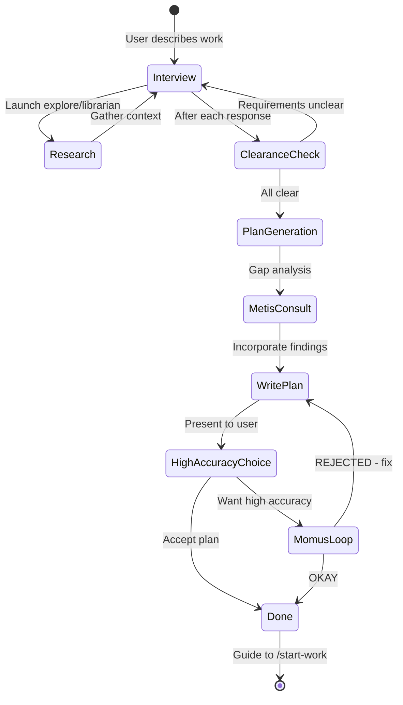

## What Are Agents?

Agents are named personalities with specialized prompts, tool restrictions, and behavioral patterns. Each agent is optimized for specific types of work, with carefully tuned system prompts and model assignments.

Think of agents as team members with different expertise:
- **Sisyphus**: The main orchestrator who plans and delegates
- **Hephaestus**: The autonomous deep worker who explores thoroughly
- **Oracle**: The read-only consultant for architecture decisions
- **Librarian**: The research specialist for documentation
- **Explore**: The fast codebase search expert

<Tip>
Agents are **not** just model wrappers. Each has custom prompts, tool permissions, and behavioral instructions optimized for their domain.
</Tip>

## Built-in Agents

### Sisyphus: The Orchestrator

<Card title="Sisyphus" icon="diagram-project">
**Default Model:** `anthropic/claude-opus-4-6` (variant: max)

**Temperature:** 0.1

**Mode:** all (available as primary or subagent)

**Description:** Main orchestrator. Plans, delegates to specialists, drives tasks to completion with aggressive parallel execution. Named after the Greek myth - he rolls the boulder every day. Never stops. Never gives up.
</Card>

**Recommended models:**
- Claude Opus 4.6 - Best overall experience
- Claude Sonnet 4.6 - Good balance of capability and cost
- Kimi K2.5 - Great Claude-like alternative
- GLM 5 - Solid option, especially via Z.ai

**Fallback chain:**
```
anthropic/claude-opus-4-6 (max)
  → kimi-for-coding/k2p5
  → kimi-for-coding/kimi-k2.5
  → openai/gpt-5.4 (medium)
  → z.ai/glm-5
  → opencode-zen/big-pickle
```

**Key behaviors:**
- Intent gate classification (research vs implementation vs investigation)
- Aggressive delegation to specialized agents
- Parallel execution when tasks are independent
- Todo enforcement through hooks
- Never starts work unless explicitly asked

**Example usage:**
```typescript
// Sisyphus is the default agent
// Just type normally and it orchestrates
"Add authentication to the API"
```

### Hephaestus: The Autonomous Worker

<Card title="Hephaestus" icon="wrench">
**Default Model:** `openai/gpt-5.3-codex` (variant: medium)

**Temperature:** 0.1

**Mode:** all

**Description:** Autonomous deep worker. Give him a goal, not a recipe. Explores the codebase, researches patterns, executes end-to-end without hand-holding. The Legitimate Craftsman.
</Card>

<Info>
Named with intentional irony. Anthropic blocked OpenCode from using their API because of this project. So the team built an autonomous GPT-native agent instead.
</Info>

**When to use Hephaestus:**
- Deep architectural reasoning needed
- Complex debugging requiring inference chains
- Cross-domain knowledge synthesis
- You specifically want GPT-5.3 Codex's reasoning style

**Fallback chain:**
```
openai/gpt-5.3-codex (medium)
  → github-copilot/gpt-5.3-codex (medium)
```

**Key behaviors:**
- Extensive exploration before implementation (5-15 minutes reading is normal)
- Heavy use of explore/librarian background agents
- Completes tasks end-to-end without frequent check-ins
- Autonomous problem-solving mindset

**Example usage:**
```typescript
// Switch to Hephaestus explicitly
Press Tab → Select "Hephaestus"
"Refactor the authentication system to support OAuth2"
```

### Oracle: The Consultant

<Card title="Oracle" icon="book">
**Default Model:** `openai/gpt-5.4` (variant: high)

**Temperature:** 0.1

**Mode:** subagent

**Description:** Read-only high-IQ consultant for architecture decisions and complex debugging. Consult Oracle when facing unfamiliar patterns, security concerns, or multi-system tradeoffs.
</Card>

**Tool restrictions:**
- Denied: `write`, `edit`, `task`, `call_omo_agent`
- Can only read and analyze

**Fallback chain:**
```
openai/gpt-5.4 (high)
  → google/gemini-3.1-pro (high)
  → anthropic/claude-opus-4-6 (max)
```

**When Oracle is called:**
- User explicitly mentions "oracle" or "consultation"
- Complex architecture decisions
- Security review needed
- Unfamiliar patterns or technologies

**Example delegation:**
```typescript
task(
  subagent_type="oracle",
  description="Architecture review",
  prompt="Review the proposed microservices architecture. Identify security risks and scalability concerns."
)
```

### Librarian: The Research Specialist

<Card title="Librarian" icon="magnifying-glass">
**Default Model:** `google/gemini-3-flash`

**Temperature:** 0.1

**Mode:** subagent

**Description:** External documentation and OSS code search. Stays current on library APIs and best practices.
</Card>

**Tool restrictions:**
- Denied: `write`, `edit`, `task`, `call_omo_agent`

**Fallback chain:**
```
google/gemini-3-flash
  → kimi-for-coding/minimax-m2.5-free
  → opencode-zen/big-pickle
```

**When Librarian is called:**
- External library or framework mentioned
- Need for official documentation
- OSS code examples needed
- API usage patterns required

**Example delegation:**
```typescript
task(
  subagent_type="librarian",
  description="Research FastAPI authentication",
  run_in_background=true,
  prompt="Find FastAPI best practices for JWT authentication and middleware setup"
)
```

### Explore: The Codebase Search

<Card title="Explore" icon="compass">
**Default Model:** `github-copilot/grok-code-fast-1`

**Temperature:** 0.1

**Mode:** subagent

**Description:** Fast codebase grep. Uses speed-focused models for pattern discovery and contextual search.
</Card>

**Tool restrictions:**
- Denied: `write`, `edit`, `task`, `call_omo_agent`

**Fallback chain:**
```
github-copilot/grok-code-fast-1
  → kimi-for-coding/minimax-m2.5-free
  → anthropic/claude-haiku-4-5
  → openai/gpt-5-nano
```

**When Explore is called:**
- Codebase pattern discovery needed
- Finding similar implementations
- Locating specific functions or files
- Understanding existing conventions

**Example delegation:**
```typescript
task(
  subagent_type="explore",
  description="Find authentication patterns",
  run_in_background=true,
  prompt="Search for existing authentication implementations and JWT usage patterns"
)
```

### Atlas: The Conductor

<Card title="Atlas" icon="list-check">
**Default Model:** `anthropic/claude-sonnet-4-6`

**Temperature:** 0.1

**Mode:** primary

**Description:** Todo-list orchestrator. Executes Prometheus plans. Distributes tasks to specialized subagents. Accumulates learnings across tasks. Verifies completion independently.
</Card>

**Key behaviors:**
- Reads plan files from `.sisyphus/plans/`
- Delegates implementation to Sisyphus-Junior
- Accumulates wisdom across tasks
- Verifies using LSP diagnostics
- Cannot delegate further (task tool denied)

**Atlas workflow:**
```
1. Read plan from .sisyphus/plans/
2. Analyze task dependencies
3. Delegate tasks by category + skills
4. Accumulate learnings in .sisyphus/notepads/
5. Verify completion
6. Report results
```

**Example activation:**
```bash
# After Prometheus creates a plan
/start-work
```

### Prometheus: The Planner

<Card title="Prometheus" icon="clipboard-list">
**Default Model:** `anthropic/claude-opus-4-6` (variant: max)

**Temperature:** 0.1

**Mode:** internal (not directly selectable)

**Description:** Strategic planner. Interviews you like a real engineer. Asks clarifying questions. Identifies scope and ambiguities. Builds a detailed plan before a single line of code is touched.
</Card>

**Write restrictions:**
- Can ONLY create/modify files within `.sisyphus/` directory
- Cannot modify source code

**Prometheus workflow:**


**Example invocation:**
```bash
# Method 1: Switch agents
Press Tab → Select "Prometheus"

# Method 2: Use @plan command
@plan "Refactor authentication system"
```

### Metis: The Gap Analyzer

<Card title="Metis" icon="magnifying-glass-chart">
**Default Model:** `anthropic/claude-opus-4-6` (variant: max)

**Temperature:** 0.3 (higher for creative gap finding)

**Mode:** subagent

**Description:** Pre-planning consultant. Catches what Prometheus missed before plans are finalized.
</Card>

**What Metis catches:**
- Hidden intentions in user's request
- Ambiguities that could derail implementation
- AI-slop patterns (over-engineering, scope creep)
- Missing acceptance criteria
- Edge cases not addressed

**Why Metis exists:**
The plan author (Prometheus) has "ADHD working memory" - it makes connections that never make it onto the page. Metis forces externalization of implicit knowledge.

### Momus: The Reviewer

<Card title="Momus" icon="clipboard-check">
**Default Model:** `openai/gpt-5.4` (variant: xhigh)

**Temperature:** 0.1

**Mode:** subagent

**Description:** Ruthless plan reviewer. Validates plans against clarity, verification, context, and big picture criteria.
</Card>

**Tool restrictions:**
- Denied: `write`, `edit`, `task`
- Can only review and validate

**Momus validation criteria:**
1. **Clarity**: Does each task specify WHERE to find implementation details?
2. **Verification**: Are acceptance criteria concrete and measurable?
3. **Context**: Is there sufficient context to proceed without >10% guesswork?
4. **Big Picture**: Is the purpose, background, and workflow clear?

**Momus loop:**
```
Prometheus generates plan
  → User requests high accuracy
  → Momus reviews plan
  → OKAY → Plan finalized
  → REJECT → Prometheus fixes issues → Resubmit
```

### Sisyphus-Junior: The Task Executor

<Card title="Sisyphus-Junior" icon="code">
**Default Model:** `anthropic/claude-sonnet-4-6`

**Temperature:** 0.1

**Mode:** all

**Description:** Category-spawned executor. The workhorse that actually writes code. Spawned by Atlas with detailed prompts and accumulated wisdom.
</Card>

**Key characteristics:**
- Focused (cannot delegate - task tool blocked)
- Disciplined (obsessive todo tracking)
- Verified (must pass lsp_diagnostics before completion)
- Constrained (cannot modify plan files)

**Why Sonnet is sufficient:**
Junior doesn't need to be the smartest - it needs to be reliable. With:
1. Detailed prompts from Atlas (50-200 lines)
2. Accumulated wisdom passed forward
3. Clear MUST DO / MUST NOT DO constraints
4. Verification requirements

Even a mid-tier model executes precisely.

### Multimodal-Looker: The Vision Agent

<Card title="Multimodal-Looker" icon="eye">
**Default Model:** `openai/gpt-5.3-codex` (variant: medium)

**Temperature:** 0.1

**Mode:** subagent

**Description:** Vision and screenshot analysis. Handles PDF parsing, image analysis, and visual debugging.
</Card>

**Tool restrictions:**
- ONLY allowed: `read`
- All other tools denied

**Use cases:**
- Screenshot analysis
- PDF document parsing
- Visual debugging
- Design mockup analysis

## Agent Modes Explained

```typescript
type AgentMode = "primary" | "subagent" | "all"
```

### Primary Mode

**Agents:** Sisyphus, Atlas

**Behavior:** Respects user's UI-selected model

**Use case:** Main agents that users interact with directly

**Example:**
```typescript
// User selects claude-sonnet-4-6 in UI
// Sisyphus uses claude-sonnet-4-6, not its default opus
```

### Subagent Mode

**Agents:** Oracle, Librarian, Explore, Metis, Momus, Multimodal-Looker

**Behavior:** Uses own fallback chain, ignores UI selection

**Use case:** Specialized agents called by orchestrators

**Example:**
```typescript
// User has gpt-5.4 selected in UI
// Oracle still uses its own chain: gpt-5.4 → gemini → opus
```

### All Mode

**Agents:** Sisyphus, Hephaestus, Sisyphus-Junior

**Behavior:** Available in both primary and subagent contexts

**Use case:** Agents that work both as main agents and delegated workers

## Model Resolution

Models are resolved through a 4-step pipeline:

```typescript
// 1. Override (agent-specific config)
if (agentConfig.model) {
  return agentConfig.model
}

// 2. Category default (task category → model mapping)
if (category && categoryConfig[category]?.model) {
  return categoryConfig[category].model
}

// 3. Provider fallback (availability check)
for (const fallback of fallbackChain) {
  if (availableModels.has(fallback.model)) {
    return fallback.model
  }
}

// 4. System default (final fallback)
return systemDefaultModel
```

<CodeGroup>
```typescript Agent Override
// oh-my-opencode.jsonc
{
  "agents": {
    "sisyphus": {
      "model": "anthropic/claude-sonnet-4-6",
      "variant": "high"
    }
  }
}
```

```typescript Category Default
// oh-my-opencode.jsonc
{
  "categories": {
    "visual-engineering": {
      "model": "google/gemini-3.1-pro",
      "variant": "high"
    }
  }
}
```

```typescript Fallback Chain
// Built into agent definition
const fallbackChain = [
  { providers: ["anthropic"], model: "claude-opus-4-6", variant: "max" },
  { providers: ["kimi-for-coding"], model: "k2p5" },
  { providers: ["kimi-for-coding"], model: "kimi-k2.5" },
  { providers: ["openai"], model: "gpt-5.4", variant: "medium" },
]
```
</CodeGroup>

## Agent Customization

You can customize any agent's behavior:

```jsonc oh-my-opencode.jsonc
{
  "agents": {
    "sisyphus": {
      // Override model
      "model": "kimi-for-coding/k2p5",
      
      // Set variant
      "variant": "high",
      
      // Append to prompt
      "prompt_append": "Always use TypeScript strict mode.",
      
      // Override fallback models
      "fallback_models": [
        "anthropic/claude-opus-4-6",
        "openai/gpt-5.4"
      ],
      
      // Ultrawork-specific overrides
      "ultrawork": {
        "model": "anthropic/claude-opus-4-6",
        "variant": "max"
      }
    }
  }
}
```

<Warning>
Changing agent prompts can break carefully tuned behaviors. Override `prompt_append` (additive) rather than replacing the entire prompt.
</Warning>

## Agent Tool Restrictions

Agents have different tool permissions based on their role:

| Agent | Denied Tools | Reason |
|-------|-------------|--------|
| Oracle | write, edit, task, call_omo_agent | Read-only consultant |
| Librarian | write, edit, task, call_omo_agent | External research only |
| Explore | write, edit, task, call_omo_agent | Search only |
| Multimodal-Looker | ALL except read | Vision analysis only |
| Atlas | task, call_omo_agent | Cannot delegate further |
| Momus | write, edit, task | Review only |
| Prometheus | write (except .sisyphus/) | Planning only |

<Info>
Tool restrictions are enforced at the permission level and cannot be overridden in config.
</Info>

## Next Steps

<CardGroup cols={2}>
<Card title="Orchestration" icon="diagram-project" href="/concepts/orchestration">
Learn how agents work together and delegate tasks
</Card>

<Card title="Ultrawork Mode" icon="bolt" href="/concepts/ultrawork">
Discover the one-word mode that activates everything
</Card>

<Card title="Configuration" icon="gear" href="/guides/configuration">
Customize agent models, prompts, and behavior
</Card>

<Card title="Categories" icon="layer-group" href="/concepts/orchestration#category-system">
Understand semantic task routing
</Card>
</CardGroup>