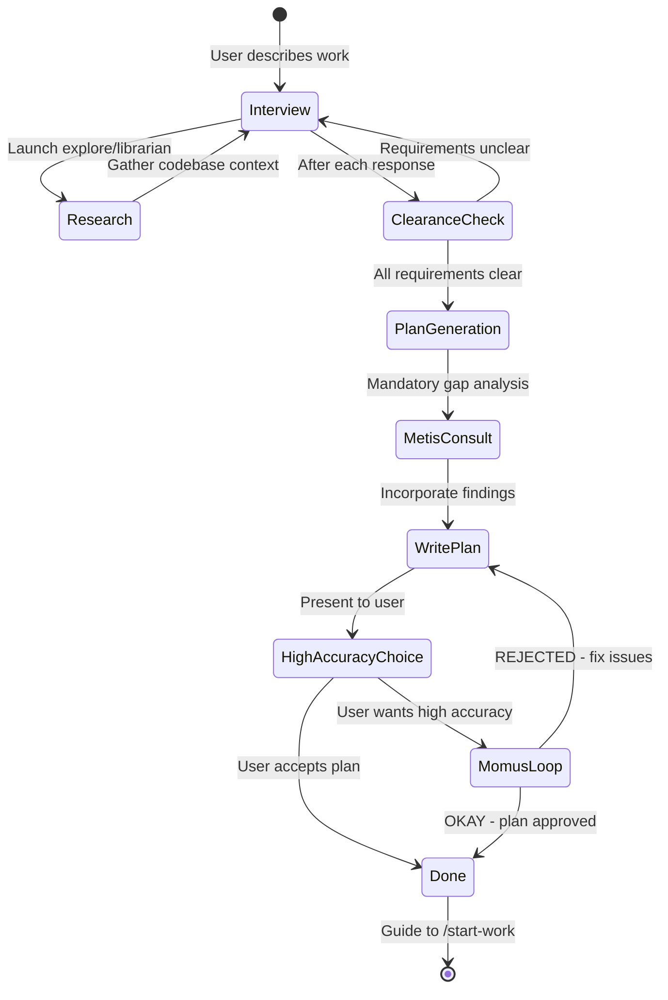
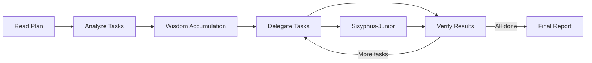

## The Core Idea

Oh My OpenAgent transforms a single AI agent into a coordinated development team through **separation of planning and execution**.

Instead of one agent doing everything sequentially, specialized agents work in parallel, each using the optimal model for their domain.

<Note>
When Sisyphus delegates work, it doesn't pick a model. It picks a **category** (semantic intent) or **agent** (specialist). The system automatically resolves to the right model.
</Note>

## Three Orchestration Approaches

| Complexity | Approach | When to Use |
|-----------|----------|-------------|
| **Simple** | Just prompt | Simple tasks, quick fixes, single-file changes |
| **Complex + Lazy** | Type `ulw` or `ultrawork` | Complex tasks where explaining context is tedious |
| **Complex + Precise** | `@plan` → `/start-work` | Precise, multi-step work requiring orchestration |

### Decision Flow

```mermaid
flowchart TD
    A[New Task] --> B{Quick fix or simple?}
    B -->|Yes| C[Just prompt normally]
    B -->|No| D{Context tedious to explain?}
    D -->|Yes| E[Type ulw]
    D -->|No| F{Need precise execution?}
    F -->|Yes| G[@plan → /start-work]
    F -->|No| E
```

## Category-Based Delegation

### What Are Categories?

Categories are **semantic task types** that map to optimal models. They eliminate distributional bias - the agent thinks about WHAT kind of work, not WHICH model.

**Built-in categories:**

| Category | Model | Best For |
|----------|-------|----------|
| `visual-engineering` | gemini-3.1-pro (high) | Frontend, UI/UX, design, styling, animation |
| `ultrabrain` | gpt-5.4 (xhigh) | Deep logical reasoning, complex architecture |
| `deep` | gpt-5.3-codex (medium) | Goal-oriented autonomous problem-solving |
| `artistry` | gemini-3.1-pro (high) | Highly creative or artistic tasks |
| `quick` | claude-haiku-4-5 | Trivial tasks - single file changes, typo fixes |
| `unspecified-low` | claude-sonnet-4-6 | Tasks that don't fit other categories, low effort |
| `unspecified-high` | claude-opus-4-6 (max) | Tasks that don't fit other categories, high effort |
| `writing` | kimi-k2p5 | Documentation, prose, technical writing |

### Why Categories Matter

<Tabs>
<Tab title="The Problem">
```typescript
// OLD: Model name creates distributional bias
task(
  subagent_type="gpt-5.4",
  prompt="Design the homepage"
)
// Model knows its limitations, may hold back
// User has to pick the model
```
</Tab>

<Tab title="The Solution">
```typescript
// NEW: Category describes INTENT, not implementation
task(
  category="visual-engineering",
  prompt="Design the homepage"
)
// Automatically routes to Gemini 3.1 Pro
// User configures once, works everywhere
```
</Tab>
</Tabs>

### Category + Skills

Categories can be combined with skills for domain expertise:

```typescript
task(
  category="visual-engineering",
  load_skills=["frontend-ui-ux"],
  description="Build responsive dashboard",
  prompt="Create a dashboard with charts and filters. Follow design system."
)
```

**What happens:**
1. Category resolves to `google/gemini-3.1-pro` (high)
2. `frontend-ui-ux` skill injects specialized UI/UX instructions
3. Agent gets context about design systems, accessibility, responsive patterns
4. Result: High-quality, design-conscious implementation

### Custom Categories

You can define custom categories:

```jsonc oh-my-opencode.jsonc
{
  "categories": {
    "database-optimization": {
      "model": "openai/gpt-5.4",
      "variant": "xhigh",
      "description": "Complex database query optimization and indexing"
    },
    "security-review": {
      "model": "anthropic/claude-opus-4-6",
      "variant": "max",
      "description": "Security audits and vulnerability analysis"
    }
  }
}
```

## Agent-Based Delegation

When work requires specific expertise, delegate to named agents:

```typescript
// Oracle: Read-only consultation
task(
  subagent_type="oracle",
  description="Architecture review",
  prompt="Review the microservices design. Identify bottlenecks."
)

// Librarian: External research
task(
  subagent_type="librarian",
  description="Research FastAPI patterns",
  run_in_background=true,
  prompt="Find FastAPI best practices for WebSocket handling"
)

// Explore: Codebase search
task(
  subagent_type="explore",
  description="Find auth patterns",
  run_in_background=true,
  prompt="Locate all authentication implementations in the codebase"
)
```

### Agent vs Category: When to Use What

<CardGroup cols={2}>
<Card title="Use Agent" icon="robot">
**When you need:**
- Specific expertise (Oracle for architecture)
- Tool restrictions (Librarian can't write files)
- Behavioral patterns (Explore for fast search)
- Read-only consultation

**Example:**
```typescript
subagent_type="oracle"
```
</Card>

<Card title="Use Category" icon="layer-group">
**When you need:**
- Semantic task routing
- Optimal model selection
- User-configurable delegation
- General implementation work

**Example:**
```typescript
category="visual-engineering"
```
</Card>
</CardGroup>

## Parallel Execution

### Background Tasks

Tasks can run asynchronously in the background:

```typescript
// Fire multiple agents in parallel
task(
  subagent_type="explore",
  description="Find patterns",
  run_in_background=true,
  prompt="Find all API route handlers"
)

task(
  subagent_type="librarian",
  description="Research docs",
  run_in_background=true,
  prompt="Find FastAPI routing best practices"
)

task(
  category="ultrabrain",
  description="Plan refactor",
  run_in_background=true,
  prompt="Analyze the routing architecture and propose improvements"
)

// All three run simultaneously
// Results come back as they complete
```

**Use background tasks for:**
- Research and exploration
- Independent analysis
- Parallel implementation
- Non-blocking work

### Synchronous Tasks

Sometimes you need sequential execution:

```typescript
// Run synchronously when order matters
const patterns = task(
  subagent_type="explore",
  description="Find patterns",
  run_in_background=false,  // Wait for result
  prompt="Find authentication patterns"
)

// Use the result in next task
task(
  category="unspecified-high",
  description="Refactor auth",
  run_in_background=false,
  prompt=`Refactor authentication based on these patterns: ${patterns}`
)
```

**Use synchronous tasks when:**
- Task B depends on Task A's result
- You need immediate feedback
- Sequential execution is required

### Concurrency Limits

Background tasks respect concurrency limits:

```jsonc oh-my-opencode.jsonc
{
  "background_agent": {
    "max_concurrent_tasks_per_model": 5,
    "max_concurrent_tasks_per_provider": 10
  }
}
```

<Info>
Default: 5 tasks per model, 10 per provider. Prevents rate limiting and resource exhaustion.
</Info>

## Prometheus + Atlas: Orchestrated Execution

### The Planning Phase: Prometheus

Prometheus interviews you like a real engineer:



**How to invoke Prometheus:**

<Tabs>
<Tab title="Method 1: Switch Agents">
```bash
# Press Tab at prompt
# Select "Prometheus" from agent list
# Describe your work
```

**When to use:** Starting a new session, want clear planning mode
</Tab>

<Tab title="Method 2: @plan Command">
```bash
# Stay in Sisyphus (default agent)
@plan "Refactor authentication system"
```

**When to use:** Mid-work, quick planning interrupt
</Tab>
</Tabs>

**Prometheus interview process:**

1. **Context gathering**: Launches explore/librarian agents
2. **Requirement clarification**: Asks questions about scope, constraints
3. **Clearance check**: Verifies all requirements are clear
4. **Metis consultation**: Gap analysis before writing plan
5. **Plan generation**: Creates detailed task breakdown
6. **Optional Momus review**: High-accuracy validation

### The Execution Phase: Atlas

Atlas executes the plan:



**Atlas workflow:**

1. Reads plan from `.sisyphus/plans/{name}.md`
2. Analyzes task dependencies
3. Accumulates wisdom from previous tasks
4. Delegates to Sisyphus-Junior with category + skills
5. Verifies completion using LSP diagnostics
6. Reports results

**What Atlas CAN do:**
- Read files to understand context
- Run commands to verify results
- Use lsp_diagnostics to check for errors
- Search patterns with grep/glob

**What Atlas MUST delegate:**
- Writing or editing code files
- Fixing bugs
- Creating tests
- Git commits

### Start Work

After Prometheus creates a plan:

```bash
/start-work
```

**What happens:**

```
User: /start-work
    ↓
[start-work hook activates]
    ↓
Check: Does .sisyphus/boulder.json exist?
    ↓
    ├─ YES (existing work) → RESUME MODE
    │   - Read existing boulder state
    │   - Calculate progress (checked vs unchecked boxes)
    │   - Inject continuation prompt
    │   - Atlas continues where you left off
    │
    └─ NO (fresh start) → INIT MODE
        - Find most recent plan in .sisyphus/plans/
        - Create new boulder.json tracking this plan
        - Switch session agent to Atlas
        - Begin execution from task 1
```

### Wisdom Accumulation

Atlas accumulates learnings across tasks:

**Notepad system:**
```
.sisyphus/notepads/{plan-name}/
├── learnings.md      # Patterns, conventions, successful approaches
├── decisions.md      # Architectural choices and rationales
├── issues.md         # Problems, blockers, gotchas encountered
├── verification.md   # Test results, validation outcomes
└── problems.md       # Unresolved issues, technical debt
```

**After each task:**
1. Extract learnings from subagent's response
2. Categorize into: Conventions, Successes, Failures, Gotchas
3. Pass forward to ALL subsequent subagents

**Why this matters:**
- Prevents repeating mistakes
- Ensures consistent patterns
- Builds cumulative knowledge
- Junior agents get senior-level context

## System Reminder Mechanism

The hook system ensures agents never stop halfway:

```
[SYSTEM REMINDER - TODO CONTINUATION]

You have incomplete todos! Complete ALL before responding:
- [x] Implement user service
- [ ] Add validation ← IN PROGRESS
- [ ] Write tests

DO NOT respond until all todos are marked completed.
```

**How it works:**
1. Agent creates todos using TodoWrite
2. Hook tracks todo state
3. If agent stops with incomplete todos:
   - Hook injects reminder into next message
   - Forces agent to continue
4. Repeat until all todos completed

<Info>
This "boulder pushing" mechanism is why the system is named after Sisyphus.
</Info>

## Delegation Patterns

### Pattern 1: Parallel Research

```typescript
// Fire multiple research agents in parallel
task(
  subagent_type="explore",
  description="Find patterns",
  run_in_background=true,
  prompt="Find all authentication implementations"
)

task(
  subagent_type="librarian",
  description="Research docs",
  run_in_background=true,
  prompt="Find FastAPI authentication best practices"
)

// Continue with other work while they research
// Results come back asynchronously
```

### Pattern 2: Sequential Refinement

```typescript
// Explore → Analyze → Implement
const patterns = task(
  subagent_type="explore",
  description="Find patterns",
  run_in_background=false,
  prompt="Find auth patterns"
)

const analysis = task(
  subagent_type="oracle",
  description="Review patterns",
  run_in_background=false,
  prompt=`Analyze these patterns: ${patterns}. Recommend best approach.`
)

task(
  category="unspecified-high",
  description="Implement",
  run_in_background=false,
  prompt=`Implement authentication using: ${analysis}`
)
```

### Pattern 3: Parallel Implementation

```typescript
// Independent tasks run in parallel
task(
  category="visual-engineering",
  description="Build frontend",
  load_skills=["frontend-ui-ux"],
  run_in_background=true,
  prompt="Create user dashboard component"
)

task(
  category="unspecified-high",
  description="Build backend",
  run_in_background=true,
  prompt="Create user API endpoints"
)

task(
  category="writing",
  description="Write docs",
  run_in_background=true,
  prompt="Document the user API"
)

// All three run simultaneously
```

### Pattern 4: Consultation Before Action

```typescript
// Always consult Oracle before architectural changes
const advice = task(
  subagent_type="oracle",
  description="Architecture review",
  run_in_background=false,
  prompt="Review proposed microservices split. Identify risks."
)

// Only proceed if Oracle approves
if (advice.includes("approved")) {
  task(
    category="unspecified-high",
    description="Implement split",
    prompt=`Implement microservices split based on: ${advice}`
  )
}
```

## Configuration

Control orchestration behavior:

```jsonc oh-my-opencode.jsonc
{
  "sisyphus_agent": {
    "disabled": false,           // Enable Atlas orchestration
    "planner_enabled": true,     // Enable Prometheus
    "replace_plan": true         // Replace default plan agent
  },
  
  "background_agent": {
    "max_concurrent_tasks_per_model": 5,
    "max_concurrent_tasks_per_provider": 10
  },
  
  "disabled_hooks": [
    // "start-work",              // Disable execution trigger
    // "prometheus-md-only"       // Remove Prometheus write restrictions
  ]
}
```

## Troubleshooting

### "I switched to Prometheus but nothing happened"

Prometheus enters interview mode by default. Answer its questions, then say "make it a plan" when ready.

### "/start-work says 'no active plan found'"

Either:
- No plans exist in `.sisyphus/plans/` → Create one with Prometheus first
- Plans exist but boulder.json points elsewhere → Delete `.sisyphus/boulder.json` and retry

### "Background tasks aren't running in parallel"

Check concurrency limits:
```jsonc
{
  "background_agent": {
    "max_concurrent_tasks_per_model": 5  // Increase if needed
  }
}
```

### "Atlas keeps delegating back to Sisyphus"

Atlas should delegate to Sisyphus-Junior, not Sisyphus. Check that:
- `task` tool is denied for Atlas
- Plan specifies correct categories

## Next Steps

<CardGroup cols={2}>
<Card title="Ultrawork Mode" icon="bolt" href="/concepts/ultrawork">
Learn the one-word mode that activates everything
</Card>

<Card title="Agents" icon="robot" href="/concepts/agents">
Understand each agent's specialization
</Card>

<Card title="Configuration" icon="gear" href="/guides/configuration">
Customize orchestration behavior
</Card>

<Card title="Skills" icon="graduation-cap" href="/guides/skills">
Learn about domain-specific skills
</Card>
</CardGroup>