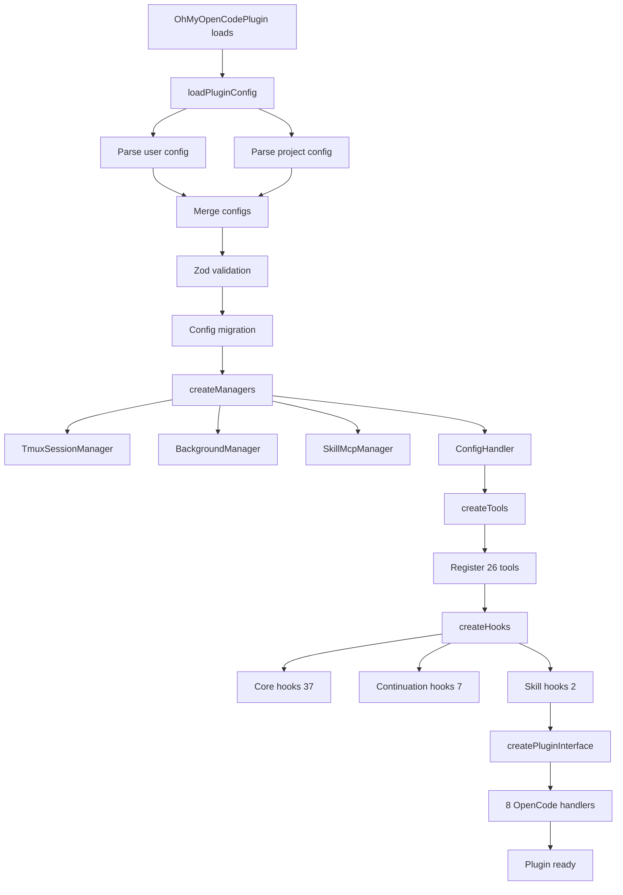

## What Is Oh My OpenAgent?

Oh My OpenAgent is a multi-model agent orchestration harness for OpenCode. It extends Claude Code (OpenCode fork) with 46 lifecycle hooks, 26 tools, and a sophisticated multi-agent system that routes work to specialized models automatically.

The key innovation: instead of one model doing everything, Oh My OpenAgent uses **specialized agents that delegate to each other** based on task type, running different models for different work.

<Note>
Not locked to Claude. Not locked to OpenAI. Not locked to anyone.
</Note>

## Architecture Components

### Plugin Entry Point

The plugin follows a 5-step initialization flow:

```typescript
OhMyOpenCodePlugin(ctx)
  ├─→ loadPluginConfig()         # JSONC parse → project/user merge → Zod validate
  ├─→ createManagers()           # TmuxSessionManager, BackgroundManager, SkillMcpManager
  ├─→ createTools()              # SkillContext + AvailableCategories + 26 tools
  ├─→ createHooks()              # 46 hooks across 3 tiers
  └─→ createPluginInterface()    # 8 OpenCode hook handlers
```

### Configuration System

Oh My OpenAgent uses a multi-level configuration system with automatic merging:

```
Project (.opencode/oh-my-opencode.jsonc)
  ↓
User (~/.config/opencode/oh-my-opencode.jsonc)
  ↓
Defaults (built-in)
```

**Merge behavior:**
- `agents`, `categories`, `claude_code`: Deep merged recursively
- `disabled_*` arrays: Set union (concatenated + deduplicated)
- All other fields: Override replaces base value

<CodeGroup>
```jsonc Project Config
{
  "$schema": "https://raw.githubusercontent.com/code-yeongyu/oh-my-openagent/dev/assets/oh-my-opencode.schema.json",
  
  "agents": {
    "sisyphus": {
      "model": "anthropic/claude-opus-4-6",
      "variant": "max",
      "ultrawork": {
        "model": "anthropic/claude-opus-4-6",
        "variant": "max"
      }
    }
  },
  
  "categories": {
    "visual-engineering": {
      "model": "google/gemini-3.1-pro",
      "variant": "high"
    }
  },
  
  "disabled_agents": ["explore"],
  "disabled_hooks": ["comment-checker"]
}
```

```jsonc User Config
{
  "agents": {
    "oracle": {
      "model": "openai/gpt-5.4",
      "variant": "high"
    }
  },
  
  "categories": {
    "ultrabrain": {
      "model": "openai/gpt-5.4",
      "variant": "xhigh"
    }
  }
}
```
</CodeGroup>

### 8 OpenCode Hook Handlers

The plugin interfaces with OpenCode through 8 hook handlers:

| Handler | Purpose |
|---------|--------|
| `config` | 6-phase config loading: provider → plugin-components → agents → tools → MCPs → commands |
| `tool` | 26 registered tools |
| `chat.message` | First-message variant, session setup, keyword detection |
| `chat.params` | Anthropic effort level adjustment |
| `chat.headers` | Copilot x-initiator header injection |
| `event` | Session lifecycle (created, deleted, idle, error) |
| `tool.execute.before` | Pre-tool hooks (file guard, rules injector, hash-anchored edits) |
| `tool.execute.after` | Post-tool hooks (output truncation, metadata store) |
| `experimental.chat.messages.transform` | Context injection, thinking block validation |

## Key Concepts

### Agent Modes

Agents have three modes that control UI model selection behavior:

```typescript
type AgentMode = "primary" | "subagent" | "all"
```

- **primary**: Respects user's UI-selected model (sisyphus, atlas)
- **subagent**: Uses own fallback chain, ignores UI selection (oracle, explore, librarian)
- **all**: Available in both contexts (OpenCode compatibility)

### Model Resolution Pipeline

Models are resolved through a 4-step pipeline:

```
1. Override (agent-specific config)
   ↓
2. Category default (task category → model mapping)
   ↓
3. Provider fallback (fallback chains by provider availability)
   ↓
4. System default (final fallback)
```

**Example fallback chain for Sisyphus:**
```
anthropic/claude-opus-4-6
  → kimi-for-coding/k2p5
  → kimi-for-coding/kimi-k2.5
  → openai/gpt-5.4
  → z.ai/glm-5
  → opencode-zen/big-pickle
```

### Categories vs Agents

<CardGroup cols={2}>
<Card title="Categories" icon="layer-group">
Semantic task types that map to optimal models. Examples: `visual-engineering`, `ultrabrain`, `quick`

**Why categories?**
- Model-agnostic task routing
- Eliminates distributional bias
- User configures once, works everywhere
</Card>

<Card title="Agents" icon="robot">
Named personalities with specialized prompts and tool restrictions. Examples: `sisyphus`, `oracle`, `explore`

**Why agents?**
- Domain-specific expertise
- Consistent behavior patterns
- Tool permission boundaries
</Card>
</CardGroup>

<Tip>
When Sisyphus delegates work, it picks a **category** (semantic), not a model name (implementation). The category automatically resolves to the right model based on your config.
</Tip>

### Background vs Synchronous Execution

Tasks can run in two modes:

<Tabs>
<Tab title="Background (Async)">
```typescript
task(
  category="visual-engineering",
  description="Update homepage styling",
  run_in_background=true,
  prompt="..."
)
```

**Flow:**
1. Launch → BackgroundManager
2. Poll status asynchronously
3. Notify parent when complete
4. Multiple tasks run in parallel

**Use for:** Exploration, research, parallel work
</Tab>

<Tab title="Synchronous">
```typescript
task(
  category="ultrabrain",
  description="Refactor authentication",
  run_in_background=false,
  prompt="..."
)
```

**Flow:**
1. Create session
2. Send prompt
3. Poll until idle
4. Return result
5. Blocks until complete

**Use for:** Sequential tasks needing immediate results
</Tab>
</Tabs>

### Hook Tiers

The 46 hooks are organized into 3 tiers:

```typescript
createHooks()
  ├─→ createCoreHooks()           // 37 hooks
  │   ├─ createSessionHooks()     // 23: context monitoring, ralph loop, model fallback
  │   ├─ createToolGuardHooks()   // 10: comment checker, file guards, hashline edits
  │   └─ createTransformHooks()   // 4: context injection, keyword detection
  ├─→ createContinuationHooks()   // 7: todo enforcement, atlas continuation
  └─→ createSkillHooks()          // 2: category skill reminders, auto-commands
```

<Info>
Hooks can be selectively disabled via `disabled_hooks` in your config.
</Info>

### Three-Tier MCP System

Oh My OpenAgent supports MCPs (Model Context Protocol) at three levels:

| Tier | Source | Mechanism |
|------|--------|----------|
| Built-in | `src/mcp/` | 3 remote HTTP: websearch (Exa/Tavily), context7, grep_app |
| Claude Code | `.mcp.json` | `${VAR}` env expansion via claude-code-mcp-loader |
| Skill-embedded | SKILL.md YAML | Managed by SkillMcpManager (stdio + HTTP) |

**Key advantage:** Skill-embedded MCPs spin up on-demand, scoped to task, gone when done. Context window stays clean.

## Initialization Flow

Here's what happens when the plugin loads:



## Config File Discovery

The plugin searches for config files in this order:

1. `.opencode/oh-my-opencode.jsonc`
2. `.opencode/oh-my-opencode.json`
3. `~/.config/opencode/oh-my-opencode.jsonc`
4. `~/.config/opencode/oh-my-opencode.json`

<Warning>
JSONC (JSON with comments) is fully supported. Use comments and trailing commas freely.
</Warning>

## Next Steps

<CardGroup cols={2}>
<Card title="Agents" icon="robot" href="/concepts/agents">
Learn about the 11 built-in agents and how they specialize
</Card>

<Card title="Orchestration" icon="diagram-project" href="/concepts/orchestration">
Understand how agents work together and delegate tasks
</Card>

<Card title="Ultrawork Mode" icon="bolt" href="/concepts/ultrawork">
Discover the "just do it" mode for lazy execution
</Card>

<Card title="Configuration" icon="gear" href="/guides/configuration">
Full configuration reference with all options
</Card>
</CardGroup>