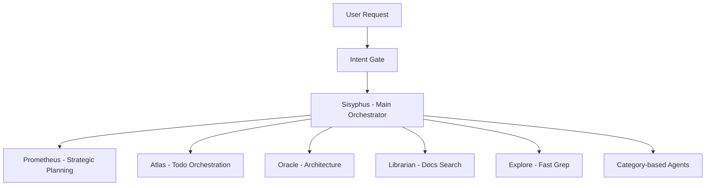

# Introduction to Oh My OpenAgent

Oh My OpenAgent is a multi-model agent orchestration harness for OpenCode. It transforms a single AI agent into a coordinated development team that actually ships code.

<Note>
**Not locked to Claude. Not locked to OpenAI. Not locked to anyone.**

Just better results, cheaper models, and real orchestration.
</Note>

## What Makes It Different

Most AI coding tools lock you into a single model, single provider, and single way of working. Oh My OpenAgent breaks free from that constraint by orchestrating across multiple models, automatically picking the right brain for the right job.

<CardGroup cols={2}>
  <Card title="Multi-Model Orchestration" icon="brain-circuit">
    Claude for orchestration, GPT for deep reasoning, Gemini for frontend, Haiku for quick tasks. All working together, automatically.
  </Card>
  
  <Card title="Specialized Agents" icon="users-gear">
    Instead of one agent doing everything, specialized agents delegate based on task type: planning, architecture, search, implementation.
  </Card>
  
  <Card title="Parallel Execution" icon="arrows-split-up-and-left">
    Fire 5+ agents simultaneously. Research, implementation, and verification happening in parallel like a real dev team.
  </Card>
  
  <Card title="Built for Production" icon="shield-check">
    Hash-anchored edits, LSP integration, intent classification, and discipline enforcement ensure reliable code generation.
  </Card>
</CardGroup>

## The Philosophy

Anthropie [**blocked OpenCode because of this project**](https://x.com/thdxr/status/2010149530486911014). They want you locked in. Claude Code is a nice prison, but it's still a prison.

We don't do lock-in here. We ride every model:

- **Claude / Kimi / GLM** for orchestration
- **GPT** for reasoning and deep code work
- **Minimax** for speed
- **Gemini** for creativity and frontend tasks

The future isn't picking one winner—it's orchestrating them all. Models get cheaper every month. Smarter every month. No single provider will dominate. We're building for that open market, not their walled gardens.

## How It Works

Oh My OpenAgent uses **specialized agents that delegate to each other** based on task type:



When Sisyphus delegates to a subagent, it doesn't pick a model name. It picks a **category**:

- `visual-engineering` → Frontend, UI/UX, design
- `deep` → Autonomous research + execution
- `quick` → Single-file changes, typos
- `ultrabrain` → Hard logic, architecture decisions

The category automatically maps to the right model. You touch nothing.

## Key Features

### Ultrawork: One Command to Rule Them All

Type `ultrawork` (or `ulw`). That's it.

Everything below, every feature, every optimization—you don't need to know it. It just works:

```bash
ultrawork
```

The agent figures everything out. Explores your codebase. Researches patterns. Implements the feature. Verifies with diagnostics. Keeps working until done.

### Discipline Agents

<CardGroup cols={2}>
  <Card title="Sisyphus" icon="repeat">
    Your main orchestrator. Plans, delegates to specialists, and drives tasks to completion with aggressive parallel execution. He doesn't stop halfway.
  </Card>
  
  <Card title="Hephaestus" icon="hammer">
    The autonomous deep worker running on GPT-5.3 Codex. Give him a goal, not a recipe. He explores, researches, and executes end-to-end.
  </Card>
  
  <Card title="Prometheus" icon="clipboard-list">
    Strategic planner. Interviews you like a real engineer, identifies scope and ambiguities, builds a plan before touching code.
  </Card>
  
  <Card title="Atlas" icon="list-check">
    Todo orchestrator. Executes Prometheus plans by distributing tasks to specialized subagents and accumulating learnings.
  </Card>
</CardGroup>

### Hash-Anchored Edits

Most agent failures aren't the model—it's the edit tool. Traditional tools rely on the model reproducing content exactly. When it can't, edits fail.

Oh My OpenAgent uses **Hashline**, inspired by [oh-my-pi](https://github.com/can1357/oh-my-pi). Every line gets tagged with a content hash:

```python
11#VK| function hello() {
22#XJ|   return "world";
33#MB| }
```

The agent edits by referencing those tags. If the file changed since the last read, the hash won't match and the edit is rejected before corruption.

<Note>
**Impact:** Grok Code Fast 1 went from **6.7% → 68.3%** success rate just from changing the edit tool.
</Note>

### World-Class Tools

<Steps>
  <Step title="LSP Integration">
    `lsp_rename`, `lsp_goto_definition`, `lsp_find_references`, `lsp_diagnostics` provide IDE precision for every agent.
  </Step>
  
  <Step title="AST-Grep">
    Pattern-aware code search and rewriting across 25 languages. No more brittle regex replacements.
  </Step>
  
  <Step title="Tmux Integration">
    Full interactive terminal. REPLs, debuggers, TUI apps. Your agent stays in session.
  </Step>
  
  <Step title="Built-in MCPs">
    Web search (Exa), official docs (Context7), GitHub search (grep.app). All baked in, no setup required.
  </Step>
</Steps>

### Skill-Embedded MCPs

MCP servers eat your context budget. We fixed that.

Skills bring their own MCP servers. Spin up on-demand, scoped to task, gone when done. Context window stays clean.

### Background Agents

Fire 5+ specialists in parallel. Context stays lean. Results when ready.

While one agent writes code, another researches patterns, another checks documentation. Like a real dev team.

## Who Should Use This

<CardGroup cols={2}>
  <Card title="For Teams" icon="users">
    Standardize on an agent harness that isn't locked to one provider. Swap models as prices drop or capabilities improve.
  </Card>
  
  <Card title="For Power Users" icon="bolt">
    You burned through thousands in LLM costs optimizing your workflow. This is the distillation of all that pain.
  </Card>
  
  <Card title="For Pragmatists" icon="gauge-high">
    You want results, not vendor lock-in. You want the best model for each task, not one-size-fits-all.
  </Card>
  
  <Card title="For Builders" icon="code">
    You're building products, not playing with demos. You need reliability, parallel execution, and production-grade tools.
  </Card>
</CardGroup>

## Real-World Impact

<Note>
**"If Claude Code does in 7 days what a human does in 3 months, Sisyphus does it in 1 hour. It just works until the task is done."**

— B, Quant Researcher
</Note>

<Note>
**"Knocked out 8000 eslint warnings with Oh My OpenCode, just in a day."**

— [Jacob Ferrari](https://x.com/jacobferrari_/status/2003258761952289061)
</Note>

<Note>
**"I converted a 45k line Tauri app into a SaaS web app overnight using Oh My OpenCode and ralph loop."**

— [James Hargis](https://x.com/hargabyte/status/2007299688261882202)
</Note>

## Compatibility

You dialed in your Claude Code setup. Good.

**Every hook, command, skill, MCP, plugin works here unchanged.** Full compatibility.

If OpenCode is Debian/Arch, Oh My OpenAgent is Ubuntu/[Omarchy](https://omarchy.org/).

## Next Steps

Ready to get started?

<CardGroup cols={2}>
  <Card title="Installation" icon="download" href="/installation">
    Install and configure Oh My OpenAgent with your model providers
  </Card>
  
  <Card title="Quickstart" icon="rocket" href="/quickstart">
    Get your first agent working in minutes with ultrawork
  </Card>
  
  <Card title="GitHub" icon="github" href="https://github.com/code-yeongyu/oh-my-openagent">
    Star the repo and join the community
  </Card>
  
  <Card title="Discord" icon="discord" href="https://discord.gg/PUwSMR9XNk">
    Connect with contributors and fellow users
  </Card>
</CardGroup>

<Warning>
**Important:** Sisyphus agent strongly recommends Claude Opus 4.6 model. Using other models may result in significantly degraded experience.
</Warning>